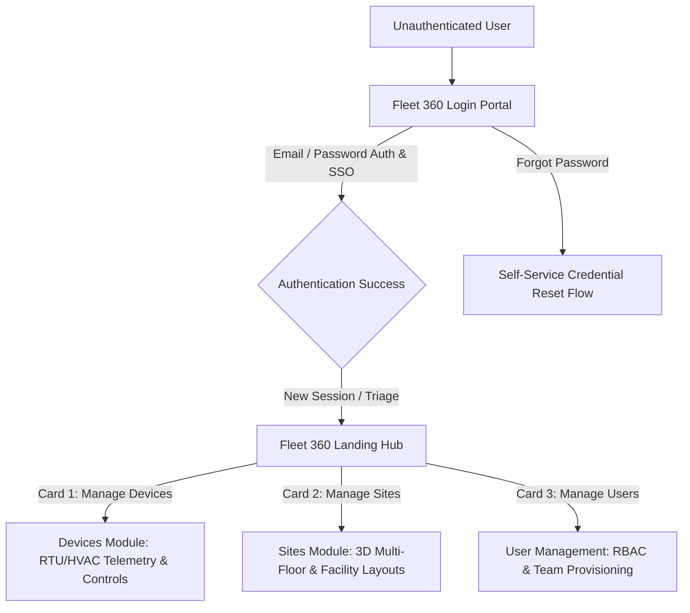

# Product Brief: Fleet 360 — Login & Landing Experience

## Executive Summary

**Fleet 360** is an enterprise-grade IoT fleet and intelligent facility management platform powered by ACE Digital, designed to give building operators, facility managers, and enterprise administrators complete visibility and granular control over commercial HVAC, refrigeration, and energy assets.

The **Login and Landing Experience** serves as the initial mission-critical gateway and triage terminal for Fleet 360. It delivers a secure, branded authentication entry point paired with an intuitive post-login launchpad. Rather than overwhelming users with raw telemetric noise immediately upon sign-in, the Landing Experience provides frictionless routing into the three foundational operational pillars: **Devices** (hardware status, telemetries, and setpoint controls), **Sites** (multi-location facility mapping and 3D architectural floor plans), and **Users** (enterprise team access control and RBAC administration).

---

## The Problem & Business Context

Enterprise fleet, facility, and HVAC operations are traditionally plagued by fragmented interfaces, high cognitive load, and cumbersome authentication workflows:
1. **Disjointed Access & High Cognitive Friction:** Operations personnel, field technicians, and facility directors often manage dozens of heterogeneous systems. A complex or generic onboarding/login surface slows daily response times during critical hardware fault events.
2. **Context Switching & "Where Do I Go?" Paralysis:** Directing every user to a monolithic, noisy dashboard upon login creates disorientation. Facility managers need immediate access to site floor plans, field service technicians need quick access to specific RTU/device units, and IT administrators need immediate user management tools.
3. **Enterprise Security & Compliance Obligations:** Commercial facilities require secure, authenticated entry compliant with organizational policies, explicit terms of service acceptance, and robust password recovery mechanisms.

---

## The Solution: Seamless Gateway & Triage

Fleet 360 resolves these friction points through a streamlined, two-tier entry architecture:

### Key Experience Elements:
1. **Branded, High-Trust Authentication Portal (`/login`):**
   - Clean split-screen visual presentation combining commercial HVAC/industrial equipment imagery with a focused login interface.
   - Enterprise single-sign-on (SSO) and email/password authentication.
   - Inline self-service credential recovery ("Forgot Password?").
   - Explicit compliance notice linking to corporate Terms & Conditions and Privacy Policies.
   - Prominent brand attribution (*"Powered by ACE Digital"*).

2. **Focused Action-Oriented Landing Hub (`/landing`):**
   - Clean welcome typography: *"Welcome to Fleet 360 — Complete visibility into your data, take control with real insights."*
   - Three high-contrast navigation cards facilitating 1-click domain navigation:
     - **Devices Card:** *"Manage devices efficiently and safely with real-time actionable insights"* -> CTA: `Manage Devices`.
     - **Sites Card:** *"Status of multi-location assets and footprint view with max reliability"* -> CTA: `Manage Sites`.
     - **Users Card:** *"Comprehensive view of your team and operators to stay on schedule"* -> CTA: `Manage Users`.

---

## What Makes This Different

- **Role-Optimized Entry, Zero Clutter:** Instead of dumping all users into a dense data table or heavy analytics dashboard by default, the landing hub acts as a clean navigational switchboard that respects the user's immediate intent.
- **Visual Clarity & Industrial Elegance:** Professional, high-contrast dark slate card deck with active red CTA buttons aligned with the Rheem/ACE Digital brand system.
- **Enterprise-Ready Extensibility:** Designed to integrate seamlessly with multi-tenant organization switchers (e.g., TotalView organization selector) and federated enterprise identity providers.

---

## Who This Serves

| Persona | Primary Goal at Entry | Target Landing Destination |
| :--- | :--- | :--- |
| **Facility Operations Manager** | Check overall campus health, floor-by-floor HVAC status, and multi-site footprints. | **Sites Module** (`/sites`) |
| **Field Technician / HVAC Specialist** | Inspect specific RTUs, adjust temperature setpoints, and diagnose alarm codes. | **Devices Module** (`/devices`) |
| **Enterprise IT / Security Admin** | Invite new site managers, configure roles, and audit permissions. | **Users Module** (`/users`) |
| **Executive / Regional Director** | High-level fleet status and power consumption trends. | **TotalView Dashboard** (`/dashboard`) |

---

## Success Criteria & Metrics

1. **Authentication Velocity & Friction Reduction:**
   - Average time-to-login under 4 seconds for returning users.
   - Self-service password reset success rate > 92%.
2. **Navigation Efficiency:**
   - > 85% of users reach their target operational task (Device, Site, or User Management) within 1 click from the landing page.
   - Reduction in session bounce rate on initial login.
3. **Security & Session Health:**
   - 100% adherence to enterprise session token expiry and secure cookie standards.
   - Zero unauthenticated leaks to protected application routes.

---

## Scope

### In-Scope (Phase 1):
- Dedicated responsive Login page with email/password authentication, validation states, and error handling.
- Forgot Password request and reset trigger mechanism.
- Legal consent and compliance links (Terms of Service, Privacy Policy).
- Post-login Landing Page / Launchpad with three primary domain routing cards (`Devices`, `Sites`, `Users`).
- Client-side route protection and token-based session persistence.

### Explicitly Out-of-Scope (Deferred to Downstream Module PRDs):
- Detailed inner screens for Devices telemetry, RTU setpoints, and schedule configurations (covered under *Devices PRD*).
- 3D Floor visualizer, 2D floorplan CAD uploads, and site analytics (covered under *Sites PRD*).
- Fine-grained RBAC permission matrix editor and LDAP directory sync (covered under *User Management PRD*).
- Real-time alarm notification engine and dispatch webhooks (covered under *Alarms PRD*).

---

## Vision

As Fleet 360 scales across global facilities, the Login and Landing experience will evolve into an **Intelligent Contextual Launchpad**:
- **Adaptive Landing:** Machine-learning-driven landing states that dynamically highlight urgent facility alarms or suggest the most relevant site based on the operator's shift, location, and role.
- **Biometric & Passwordless Auth:** Fast, seamless WebAuthn / Passkey support for mobile field tablets.
- **Unified Fleet Hub:** Single sign-on federation across the broader ACE Digital and Rheem commercial IoT ecosystem.
